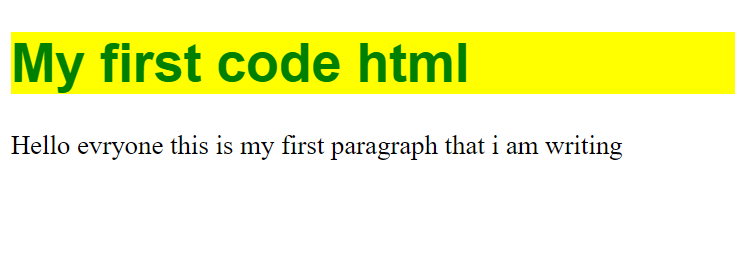

# 🔖:Rédigez vos premières lignes de HTML et CSS
---------------------------------------------


Pour cet article j'aime vous montrer comment créer un page HTML dans une langage de balise  

✨ insere un titre dans le contenu en head 
-------------------------------------------


Code en head 
```
<!DOCTYPE html>
<html>
<head>
	<link rel="stylesheet"  href="styles.css">
	<meta charset="utf-8">
	<meta name="viewport" content="width=device-width, initial-scale=1">
	<title>Page html</title>
	</head>

<body>
	<h1> My first code html </h1>

	<p> Hello everyone this is my first paragraph that i am writing  </p>
</body>
</html>
```

🌀 maintenant ecrire un paragraphe dans le contenu body  utiliser le balise 
--------------------------------------------------------------------------------


code body 
```
<p> Hello everyone this is my first paragraph that i am writing  </p>
```

🐴 Personalise votre contenu head  en CSS
-----------------------------


```
h1 {
    color: green;
    background-color :yellow;
    font-family: sans-serif;
}

```


